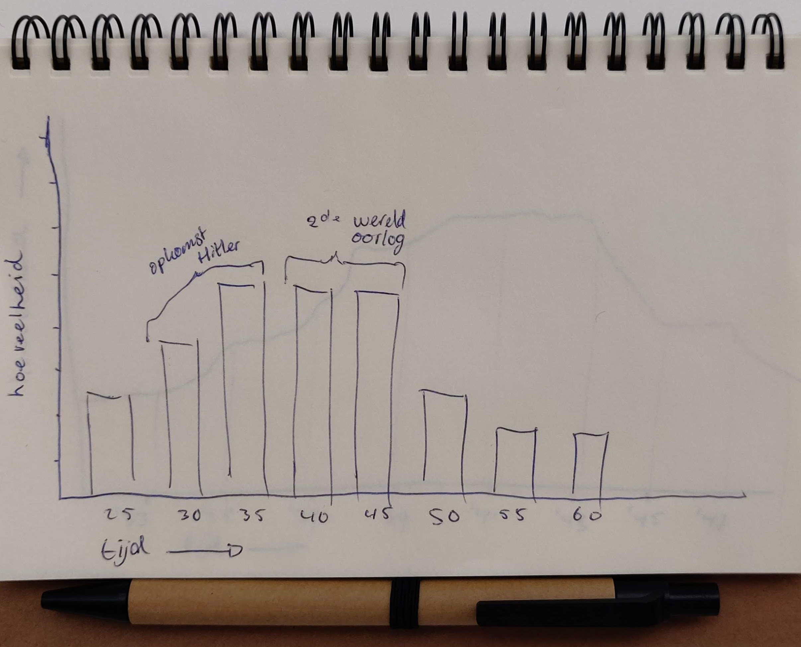

# Openbare Bibliotheek Amsterdam API

## Inhoudsopgave
1. **[Onderzoek](#1--onderzoek)**
2. **[Hypothese](#2--hypothese)**
3. **[Code](#3--code)**
4. **[Resultaat](#4--resultaat)**

___

### 1 | Onderzoek
#### Onderzoeksvragen
* Is er een verband tussen het aantal bladzijdes van een boek en het jaar van publicatie?
* Is er een verband tussen aantal bladzijdes van een boek en de locatie van publicatie?
* Is er een verband tussen Duitse boeken en het jaartal van publiceren?
* Zijn het mannelijke of vrouwelijke schrijvers die dikkere boeken maken?
* Groeit het aantal boeken naar mate de tijd verstrijkt?

#### Hoofdvraag
_**Is er een verband tussen Duitse boeken en het jaartal van publiceren?**_

#### Deelvragen
* Zijn er rond de 2de wereldoorlog meer of minder Duitse boeken gepubliceerd?
* Is er een verandering van de locatie van publicatie tijdens de 2de wereldoorlog?


### 2 | Hypothese

_**H1** Er is een verschil in de hoeveelheid publicaties gedurende voor de 2de wereldoorlog en tijdens de 2de wereldoorlog._

#### Schetsen hypothese



### 3 | Code
Om de deelvragen te beantwoorden heb ik gebruik gemaakt van de API van de OBA. Door op onderzoek te gaan met de API heb ik verschillende waarde gebruikt om data te krijgen. Met deze data kan ik de hoofdvraag en de deelvragen beantwoorden.

``` javascript
  client.get('search', {
    q: 'language:ger year:1937', // zoektermen
    sort: 'title', // resultaten gesorteerd op titel
    page: pageNumber, // paginanummers veranderen d.m.v. een loop
    facet: 'type(book)', // alleen boeken als resultaten
    refine: true // zorgt er voor dat bovenste werkt
  })
```

Dit deel van de code zorgt er voor dat er gezocht wordt naar Duits-talige boeken die gepubliceerd zijn in het jaar 1937. Om er voor te zorgen dat de data van de API gelezen kan worden in de terminal heb ik de volgende functie gebruikt, waarbij elk boek van de zoekresultaten getoond werd.
``` javascript
  .then(function(results) {
    JSON.parse(results).aquabrowser.results.result.forEach(function(book) {
      console.log(book);
      let bookRes = {
        // verschillende values die belangrijk zijn
      }
    })
  })
```

In deze functie is het mogelijk om verschillende soorten code te schrijven om specifieke values uit de data te krijgen. Hieronder leg ik uit wat voor een soort code ik heb gebruikt om de deelvragen te beantwoorden. Daarnaast geef ik elk boek een unieke ID mee.
``` javascript
  Id: parseInt(book.id.nativeid),
```

#### Hoofdvraag
Om de hoofdvraag te beantwoorden heb ik de volgende stukken code gebruikt om de juiste data te krijgen.
``` javascript
  Year : book.publication.year.$t, // haalt het jaar van publicatie op
```
``` javascript
  Language : book.languages.language.$t, // haalt de taal van het boek op
  ```
Echter had ik het probleem dat af en toe de taal van een boek niet bestond. Hierdoor kreeg ik een foutmelding en werden niet alle resultaten getoond. Dit heb ik opgelost door de code uit te breiden. Als de taal niet bekend is, wordt er 'Unknown' meegegeven. Als de taal wel bekend is, wordt deze ook getoond.
``` javascript
  Language : (typeof book.languages === "undefined") ? "Unknown" : book.languages.language.$t,
```
Wanneer ik ``node index.js`` in de terminal doe, krijg ik de volgende data terug:

| ID | Year | Language |
| ----------- | ----------- |
| 45739 | 1937 | German |
| 515609 | 1937 | German |
| 518138 | 1937 | German |
| 1099531 | 1937 | German |
| 591203 | 1937 | German |
| Etc. | Etc. | Etc. |

Helaas is het probleem dat ik te veel request moet plegen om een goed resultaat te krijgen. Ik ben nog niet achter dit probleem gekomen om zonder foutmeldingen alle resultaten te krijgen.

#### Deelvragen
Om de deelvraag te beantwoorden over de locatie van de publicatie van het boek heb ik de volgende regel toegevoegd aan mijn code.
``` javascript
  Location : (typeof book.publication.publishers.publisher.place === "undefined") ? "Unknown" : book.publication.publishers.publisher.place,
```
Deze value had hetzelfde probleem wat ik had met de taal. De locatie was af en toe niet beschikbaar waardoor het vast liep.

Voor de deelvragen over de verschillende jaartalen rondom de oorlog verander ik nog handmatig het jaartal in de query. Echter is het me nog niet gelukt om een goede loop te schrijven waardoor de request door verschillende jaartalen heen gaat.

### 4 | Resultaat

De data die ik krijg van de API heb ik nog niet werkend gekregen in D3. Ik moet nog meer onderzoek doen naar het ophalen van meer pagina's en het ophalen van data van meerdere jaren.
