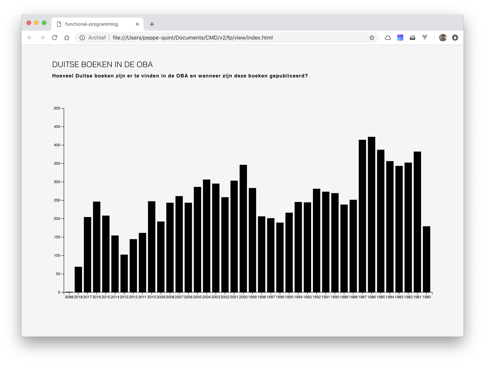
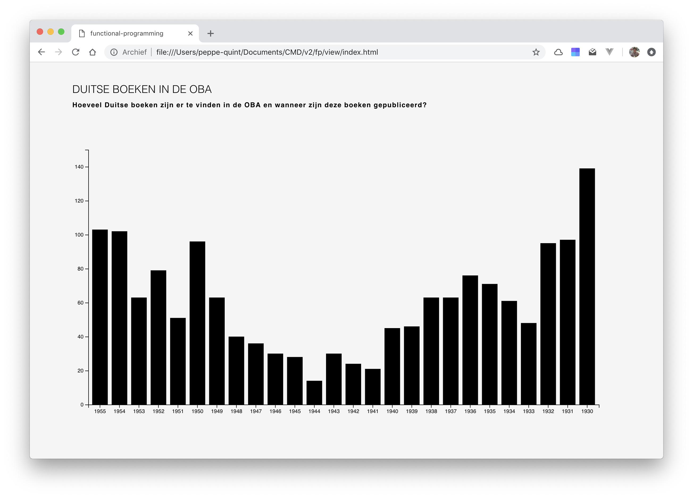
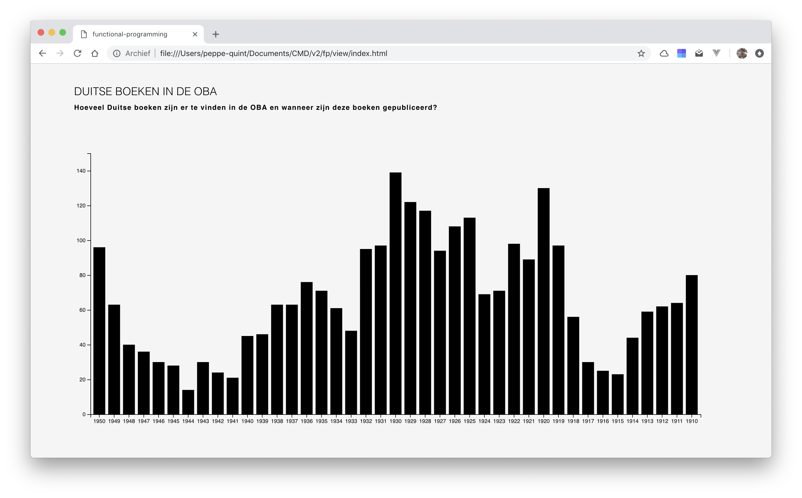

# Functional Programming

For this assignment I used the OBA API to show all the German books that are available in the public library of Amsterdam. With the API I retrieved data from the library. To answer my research case I created a data visualisation of the collected data. The rest of the README is written in Dutch to clarify my research case as good as possible.

## Inhoudsopgave

- [Onderzoeksvragen](#onderzoeksvragen-)
- [Hypothese](#hypothese)
  - [Verwachting](#verwachting)
  - [Schets](#schets)
- [Data](#data)
  - [Problemen](#problemen)
  - [Oplossingen](#oplossingen)
- [Visualisatie](#visualisatie)
  - [Iteratie een](#iteratie-een)
  - [Iteratie twee](#iteratie-twee)
  - [Iteratie drie](#iteratie-drie)
- [Conclusie](#conlusie)
- [Bronnen](#bronnen)
- [Credits](#credits)

## Onderzoeksvragen

Voordat ik in de code ben gedoken om zo goed en veel mogelijk data van de OBA te ontvangen heb ik een aantal onderzoeksvragen opgesteld:

1. Is er een verband tussen het aantal bladzijdes van een boek en het jaar van publicatie?
2. Is er een verband tussen aantal bladzijdes van een boek en de locatie van publicatie?
3. **Is er een verband tussen Duitse boeken en het jaartal van publiceren?**
4. Zijn het mannelijke of vrouwelijke schrijvers die dikkere boeken maken?
5. Groeit het aantal boeken naar mate de tijd verstrijkt?

De 3de vraag leek mij zeer interessant om te onderzoeken. Ik dacht daarnaast gelijk aan het aantal publicaties rond de 2de Wereldoorlog. Met deze gedachte heb ik een hypothese opgesteld.

## Hypothese

**H1** Er is een verschil in de hoeveelheid publicaties gedurende voor de 2de Wereldoorlog en tijdens de 2de Wereldoorlog.

_EDIT:_(zie [Iteratie 3](#iteratie-drie))
**H1** Er is een verschil in hoeveelheid publicaties gedurende de 2 wereldoorlogen van de vorige eeuw.

### Verwachting

Bij deze hypothese heb ik een verwachting. Deze verwachting heb ik visueel gemaakt door middel van een schets, zoals hieronder te zien is. Ik verwacht dat er in de tijd van Hitler, wanneer hij populairder werd, er meer Duitse boeken gepubliceerd zijn. Na de 2de Wereldoorlog denk ik dat er minder gepubliceerd zijn.

### Schets


> Toelichting van de schets staat hierboven.

## Data

### Problemen

Om de data van de OBA op te halen, heb ik gebruik gemaakt van de API. Er zijn verschillende manier om de data op te halen. Om bepaalde zoekresultaten te ontvangen heb ik de zoekopdracht ingevuld op de volgende manier:

```javascript
.get("search", {
  q: "language:ger year:" + year, // taal Duits met jaartal
  sort: "title", // gesorteerd op titel
  page: pageNumber, // paginanummers
  facet: "type(book)", // type book
  refine: true
})
```

Om de resultaten te krijgen en weer te geven moest het ontleed worden.

```javascript
.then(function(results) {
  JSON.parse(results).aquabrowser.results.result.forEach(function(book) {})
```

### Oplossingen

Echter heb ik gemerkt dat dit uiteindelijk niet de goede manier is om data op te halen. [Wouter](https://github.com/maanlamp) heeft een wrapper gemaakt om alle data op te halen. Deze heb ik gebruik, waardoor het ophalen van resultaten veel makkelijk gaat. Alle resultaten worden nu weergegeven en er zit geen dubbele data bij. Daarnaast is het creëeren van een object met 'schone data' ook makkelijker. Dit komt doordat ik maar een aantal functies heb geschreven, waar alles wordt 'gefilterd en schoongemaakt'.

```javascript
.get("search", {
  q: "deutsch", // zoektermen
  sort: "year", // sorteren op
  refine: true,
  facet: ["type(book)", "language(ger)"], // alleen duitse boeken
  count: 28615, // hoeveel resultaten?
  log: true
})
```

```javascript
// functie wordt aangeroepen wanneer request binnen is
const getBookObject = data => {
  const bookObject = (createObject = {
    title: cleanTitle(data), // functie titel opschonen
    author: cleanAuthor(data), // functie auteur opschonen
    year: cleanYear(data) // functie jaar opschonen
  });
  return bookObject;
};
```

```javascript
// clean up string title of books
const cleanTitle = data => {
  const getTitle =
    typeof data.titles.title.$t === "undefined"
      ? "Unknown"
      : data.titles.title.$t;
  return getTitle.split(/[:,/]/)[0].trim();
};
```

> Voorbeeld van een van de functies

## Visualisatie

Door middel van D3 is het mogelijk om deze data om te zetten naar een visualisatie. D3 is zeer handig omdat de data die je wilt gebruiken, makkelijk kan filteren en sorteren. Zo wil ik voor alsnog alleen het jaartal en het aantal boeken per jaartal. Door `d3.nest()` te gebruiken is dit makkelijk en snel gedaan.

```javascript
const obaData = d3
  .nest()
  .key(d => d.year) // ophalen van alle jaren
  .rollup(d => d.length) // aantal resultaten per jaar berekenen
  .entries(data);
```

### Iteratie een

Echter is de hoeveelheid requests die ik naar de server stuur, te veel. Meer dan 28.000 requests wordt niet getolereerd. Dus heb ik de zoekterm iets moeten aanpassen en het aantal iets naar beneden gesteld, om zo toch nog genoeg data binnen te krijgen (`q:"buch", count: 10000`).



> Het jaartal gaat maar tot 1980

### Iteratie twee

Uiteindelijk is het mij wel gelukt om 19.429 resultaten terug te krijgen van de API

Om mijn hypothese te beantwoorden heb ik de jaartallen tussen 1930 en 1955 nodig. Met `d3.nest()` is het mogelijk om de data te filteren. Om de jaartalen te krijgen heb ik het volgende gebruikt:

```javascript
.filter(y => y.key > 1929 && y.key < 1956);
```



> Duidelijke piek bij 1930

### Iteratie drie

Naar aanleiding van de vorige iteratie heb ik er voor gekozen mijn hypothese aan te passen. Er is een duidelijke piek bij 1930. Ik vroeg mijzelf meteen af wat er dan tijdens de Eerste Wereldoorlog gebeurde met de publicatie van boeken. Daarom heb ik gekeken vanaf het jaartal 1910 tot aan 1950.

```javascript
.filter(y => y.key > 1909 && y.key < 1951);
```



> Dalen te zien tijdens de oorlogen

## Conclusie

Concluderen, er is een duidelijk verschil te zien in het aantal Duitse boeken tijdens de wereldoorlogen. Er zijn flinke dalen te zien. Echter wil het niet zeggen dat er in die tijd ook minder boeken zijn gepubliceerd. Het gaat hier om de aantallen die terug te vinden zijn in de bibliotheek in Amsterdam.

Daarnaast had ik, als ik terug kijk op mijn [schets](#schets) een andere trend verwacht.

## Bronnen

- [Wrapper Maanlamp](https://github.com/maanlamp/node-oba-api-wrapper)
- [Rising Stack](https://blog.risingstack.com/d3-js-tutorial-bar-charts-with-javascript/)
- [MDN](https://developer.mozilla.org/en-US/docs/Web/JavaScript)
- [Wiki D3](https://github.com/d3/d3/wiki)
- [Learn JS Data](http://learnjsdata.com/group_data.html)

## Credits

- [Maanlamp voor zijn bevrijdende wrapper](https://github.com/maanlamp)
- [Duidelijke cheatsheet van Daniël](https://github.com/DanielvandeVelde/functional-programming/blob/master/README.md)
- Tim voor het duidelijke college over `d3.nest()`
