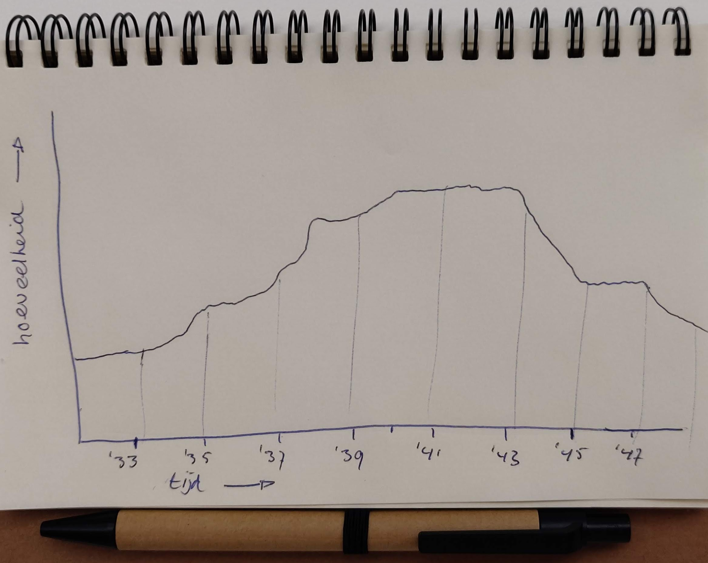

# Openbare Bibliotheek Amsterdam API

## Inhoudsopgave
1. **Onderzoek**
  * Onderzoeksvragen
  * Hoofdvraag
  * Deelvragen
2. **Hypothese**
  * Schetsen hypothese
3. **Code**
  * Hoofdvraag
  * Deelvragen
4. **Proces**

### 1 | Onderzoek
#### | Onderzoeksvragen
* Is er een verband tussen het aantal bladzijdes van een boek en het jaar van publicatie?
* Is er een verband tussen aantal bladzijdes van een boek en de locatie van publicatie?
* Is er een verband tussen Duitse boeken en het jaartal van publiceren?
* Zijn het mannelijke of vrouwelijke schrijvers die dikkere boeken maken?
* Groeit het aantal boeken naar mate de tijd verstrijkt?

#### | Hoofdvraag
Is er een verband tussen Duitse boeken en het jaartal van publiceren?

#### | Deelvragen
* Zijn er rond de 2de wereldoorlog meer of minder Duitse boeken gepubliceerd?
* Is er een verandering van de locatie van publicatie tijdens de 2de wereldoorlog?


### 2 | Hypothese

> **H1** Er is een verschil in de hoeveelheid publicaties gedurende voor de 2de wereldoorlog en tijdens de 2de wereldoorlog.

#### | Schetsen hypothese




### 3 | Code
Om de deelvragen te beantwoorden heb ik gebruik gemaakt van de API van de OBA. Door op onderzoek te gaan met de API heb ik verschillende waarde gebruikt om data te krijgen. Met deze data kan ik de hoofdvraag en de deelvragen beantwoorden.

``` javascript
  client.get('search', {
    q: 'language:ger year:1937', // zoektermen
    sort: 'title', // resultaten gesorteerd op titel
    page: pageNumber, // paginanummers veranderen d.m.v. een loop
    facet: 'type(book)', // alleen boeken als resultaten
    refine: true // zorgt er voor dat bovenste werkt
  })
```

Dit deel van de code zorgt er voor dat er gezocht wordt naar Duits-talige boeken die gepubliceerd zijn in het jaar 1937. Om er voor te zorgen dat de data van de API gelezen kan worden in de terminal heb ik de volgende functie gebruikt, waarbij elk boek van de zoekresultaten getoond werd.
``` javascript
  .then(function(results) {
    JSON.parse(results).aquabrowser.results.result.forEach(function(book) {
      console.log(book);
      let bookRes = {
        // verschillende values die belangrijk zijn
      }
    })
  })
```

In deze functie is het mogelijk om verschillende soorten code te schrijven om specifieke values uit de data te krijgen. Hieronder leg ik uit wat voor een soort code ik heb gebruikt om de deelvragen te beantwoorden. Daarnaast geef ik elk boek een unieke ID mee.
``` javascript
  Id: parseInt(book.id.nativeid),
```

#### | Hoofdvraag
Om de hoofdvraag te beantwoorden heb ik de volgende stukken code gebruikt om de juiste data te krijgen.
``` javascript
  Year : book.publication.year.$t, // haalt het jaar van publicatie op
```
``` javascript
  Language : book.languages.language.$t, // haalt de taal van het boek op
  ```
Echter had ik het probleem dat af en toe de taal van een boek niet bestond. Hierdoor kreeg ik een foutmelding en werden niet alle resultaten getoond. Dit heb ik opgelost door de code uit te breiden. Als de taal niet bekend is, wordt er 'Unknown' meegegeven. Als de taal wel bekend is, wordt deze ook getoond.
``` javascript
  Language : (typeof book.languages === "undefined") ? "Unknown" : book.languages.language.$t,
```
Wanneer ik ``node index.js`` in de terminal doe, krijg ik de volgende data terug:

| ID | Year | Language |
| ----------- | ----------- |
| 45739 | 1937 | German |
| 515609 | 1937 | German |
| 518138 | 1937 | German |
| 1099531 | 1937 | German |
| 591203 | 1937 | German |
| Etc. | Etc. | Etc. |

Helaas is het probleem dat ik te veel request moet plegen om een goed resultaat te krijgen. Ik ben nog niet achter dit probleem gekomen om zonder foutmeldingen alle resultaten te krijgen.

#### | Deelvragen
Om de deelvraag te beantwoorden over de locatie van de publicatie van het boek heb ik de volgende regel toegevoegd aan mijn code.
``` javascript
  Location : (typeof book.publication.publishers.publisher.place === "undefined") ? "Unknown" :
```
Deze value had hetzelfde probleem wat ik had met de taal. De locatie was af en toe niet beschikbaar waardoor het vast liep.

Voor de deelvragen over de verschillende jaartalen rondom de oorlog verander ik nog handmatig het jaartal in de query. Echter is het me nog niet gelukt om een goede loop te schrijven waardoor de request door verschillende jaartalen heen gaat.

### 4 | Proces

#### 29 oktober 2018
[Package van Rijk van Zanten](https://github.com/rijkvanzanten/node-oba-api) geïnstalleerd om via Node makkelijk met de API van de OBA te communiceren.
``` bash
  $ npm install rijkvanzanten/node-oba-api
```
Daarnaast heb ik onderzoek gedaan naar het gebruik van de API. In het bestand [index.js](index.js) wordt er via ``client.get('search'){}`` gezocht naar de resultaten. Er zijn een aantal waardes die ik heb toegevoegd en heb gewijzigd:
``` javascript
  client.get('search', {
    q: 'oorlog', // objecten worden gezocht met die te maken hebben met het thema oorlog
    sort: 'relevance', // de resultaten worden gesorteerd op relevantie
    page: '9', // de resulaten van pagina 9 worden getoond
    facet: 'type(book)', // alleen het type boek wordt gezocht
    refine: true // zorgt er voor dat er alleenb boeken getoond worden
  })
```

#### 30 oktober 2018
Om er voor te zorgen dat de data getoond wordt in de Terminal ontleedt JSON de data. Dit gebeurt nadat er naar data is gezocht in de API:
``` javascript
  .then(function(results) {
    JSON.parse(results).aquabrowser.results.result.forEach(function(book) {
      console.log(book);
    })
  })
```

Via deze functie wordt elk gevonden resultaat in een functie gezet en vervolgens gelogd in de ``console.log``. Door middel van ```node index.js ``` krijg ik de data terug in de Terminal.
Hierdoor zie ik welke data er beschikbaar is. Op basis hiervan heb ik een aantal onderzoeksvragen opgesteld.

#### 31 oktober 2018
Uitgezocht welke code er nodig is om er voor te zorgen dat de bijv. de titel van een boek alleen getoond wordt.
``` javascript
  console.log(book.titles.title.$t, id) // pakt de titel door te zoeken in b0ok -> titles -> title.
```
Bij de titel van het boek lukt dit, maar bij de auteur van het boek kan het zo zijn dat er meerdere auteurs mee hebben geholpen aan het boek, dus werkt het niet om direct te zoeken, zoals de code hieronder:
``` javascript
  console.log(book.authors.author.$t); // werkt niet: "undefined"
```
Om te checken of er uberhaupt een auteur aanwezig is, gebruik ik de volgende code:
``` javascript
  (typeof book.authors === "undefined" || typeof book.authors['main-author'] === "undefined") ? 'Author unknown' : book.authors['main-author'].$t
  //  als de auteur of de hoofd-auteur 'undefined' is, wordt er 'Author unknown' getoond, anders wordt de auteur opgehaald
```
Dit stukje code heb ik ook gebruikt bij de pagina-nummering en het jaar van publicatie van een boek. '_Missing data_' is de oorzaak dat er ``undefined`` komt te staan.

#### 1 november 2018

Om de resultaten van de zoekopdrachten goed weer te geven, heb ik de values in een variabelen gestopt:
``` javascript
  let bookRes = {
    Title : book.titles.title.$t, // titel van het boek
    Author : (typeof book.authors === "undefined" || typeof book.authors['main-author'] === "undefined") ? 'Author unknown' : book.authors['main-author'].$t, // auteur van het boek
    Year : book.publication.year.$t, // jaar van uitgave
    Language : (typeof book.languages === "undefined") ? "Unknown" : book.languages.language.$t, // taal van het boek
    Pages : (typeof book.description === "undefined") ? "Unknown" : book.description['physical-description'].$t // aantal pagina's van het boek
  }
```

Hierdoor wordt er per boek een Array aangemaakt. Dit doe ik ook door elk boek te pushen naar een nieuwe Array.
``` javascript
  let resList = []; // lege array
  resList.push([bookRes]); // elk zoekresultaat wordt in de lege array gepusht
  console.log(resList); // de lijst met boeken wordt hierdoor getoond in de terminal
```

Helaas wordt er op dit moment alleen de eerste 20 resultaten weergegeven, terwijl er meer resultaten zijn.

Omdat de data die binnenkomt erg rommelig is, moet de data 'schoongemaakt' worden. Bijv. bij het aantal paginanummers.
Zonder aanpassing aan de value wordt er dit getoond:
``` bash
  Pages: '343 p., [16] p. pl: ill ; 24 cm',
```

Het enige wat ik wil laten zien is het aantal paginanummers. Daarom moet alles na het eerste cijfer van de zin verwijderd worden.
``` javascript
  let pagesString = bookRes['Pages']; // alle waarde van deze value wordt in deze variabelen gestopt
  let indexPageString = pagesString.split(/[p: ]/)[0].replace(/[\[\]']+/g, '').concat(' pages');
  // eerst wordt alles vanaf 'p:' er vanaf gehaald
  // vervolgens worden [] vervangen door een leeg veld
  // als laatste wordt er achter elke waarde het woord ' pages' geplakt
  console.log(indexPageString); // controle of het werkt
```

Het lukt me nog niet de nieuwe waarde terug te geven aan het resultaat van het boek.

#### 2 november 2018
De oplossing om er voor te zorgen dat de nieuwe waarde wat in ``Pages`` is vrij simpel. Het volgende stukje code heb ik toegevoegd om er voor te zorgen dat het werkt:
``` javascript
  bookRes.Pages = indexPageString;
```

Net zoals het weergeven van de pagina's, heb ik met het volgende stuk code er voor gezorgd dat de titel netjes wordt weergegeven:
``` javascript
  // Title: Cut off part after /
  let titleString = bookRes.Title;
  let indexTitleString = titleString.split('/')[0].trim();
  // console.log(indexTitleString);
  // return indexTitleString
  bookRes.Title = indexTitleString;
```
